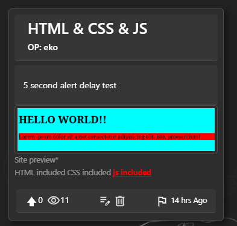
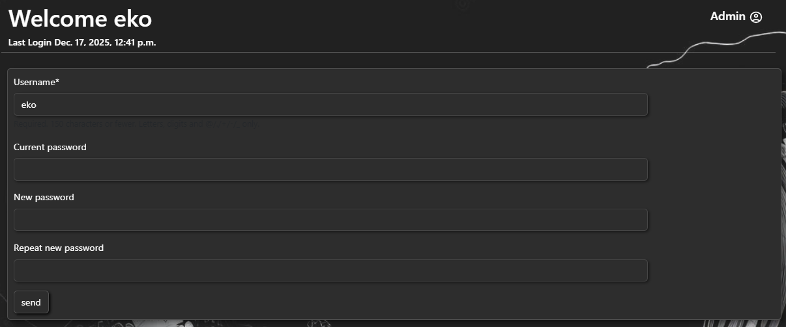
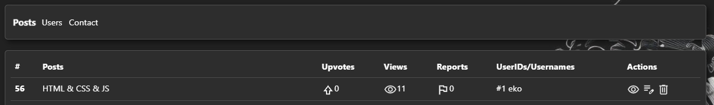
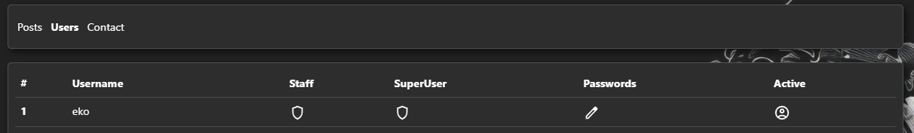
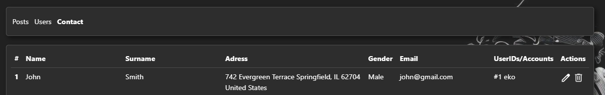

<h1>The Django Project Contents</h1>

<h2>Current Apps</h2>

<ul>
    <b>
    <li><a href="">accounts</a></li>
    <li><a href="">home</a></li>
    <li><a href="">post</a></li>
    <li><a href="">user_profile</a></li>
    <li><a href="">admin_panel</a></li>
    </b>
</ul>

<hr>

<h2>Accounts contents</h2>

Accounts app handles the login, logout, signin procedures.
<br>
And mainly also handles the login, signin forms.

<hr>

<h2>Home contents</h2>

Home app handles displaying the home page with additional features such as,
the Top Post Filter and displaying Popular Posts.
The view functions (upvote,delete etc.) are copied from the Post app,
for the Popular Post page.

<hr>

<h2>Post contents</h2>

```
    "title": Post title
    "desc": Post description

    "image": Post image
    "video": Post video

    "user_html": A HTML file that will turn the post into a web page
    "user_css": A CSS file that will embed into the html using <style>
    "user_js": A JS file that will embed into the html using <script>
    "site_preview": the sites web preview ("this is just an image for now")
    
    "upvotes": Post upvotes is just a positive int that toggles for each user
    "post_views": Post views increases everytime a user goes into detail page
    "reports": Same as Post upvotes but renamed
```
<hr>

<h3>Example:</h3>





<br>

Post Handles:

<ul>
    <b>
        <li>Creation</li>
        <li>Deletion</li>
        <li>Updating</li>
        <li>Upvoting</li>
        <li>Viewership</li>
        <li>Detail</li>
        <li>Comments</li>
        <li>About us</li>
        <li>Contact us (Form)</li>
        <li>Reporting</li>
    </b>
</ul>

<br>

<hr>

<h2>User_profile contents</h2>

The User_profile app is quite underdeveloped, and it only displays the profile page and allows the user to change its password and username.



<hr>

<h2>Admin Panel contents</h2>

Admin Panel controls not surprisingly the admin panel, where accounts with staff and superuser access can use it.

<h3>Categories:</h3>

<ul>
    <b>
    <li>Posts Category: (Default)</li>
    <ul>
        <li>Lists ID, Title, Upvotes, Views, Reports, UserIDs/Usernames</li>
    </ul>
    Actions:
    <ul>
        <li>Viewing the detail page of the post</li>
        <li>Modifying</li>
        <li>Deletion</li>
    </ul>
    <li>User Category:</li>
    <ul>
        <li>Lists ID, Username</li>
    </ul>
    Actions:
    <ul>
        <li>Account Deactivation/Activation</li>
        <li>Password Change</li>
        <li>Account Staff Permissions</li>
        <li>Account SuperUser Permissions</li>
    </ul>
    <li>Contact Category:</li>
    <ul>
        <li>Lists ID, Name, Adress, Gender, Email, 	UserIDs/Accounts</li>
    </ul>
    Actions:
    <ul>
        <li>Modifying</li>
        <li>Deletion</li>
    </ul>
    </b>
</ul>

<hr>

<h3>Examples:</h3>





